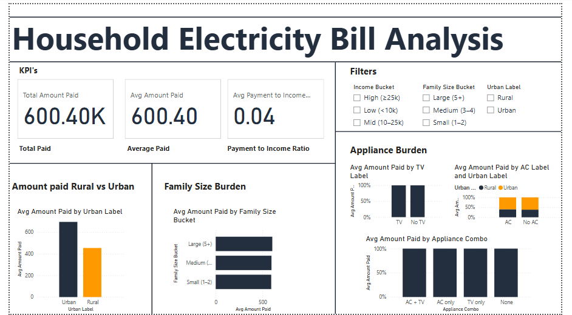

---

## 🗂 Dataset Description
**File:** `data/bill_data.csv`  
**Columns:**
- `num_rooms` → Number of rooms in the household  
- `num_people` → Household members  
- `housearea` → Area of the house (sq.ft.)  
- `is_ac` → 1 if AC present, else 0  
- `is_tv` → 1 if TV present, else 0  
- `is_flat` → 1 if flat/apartment, else independent house  
- `ave_monthly_income` → Household average monthly income  
- `num_children` → Number of children in the household  
- `is_urban` → 1 if urban, 0 if rural  
- `amount_paid` → Energy bill paid  

---

## 🛠 Tools & Skills Demonstrated
- **SQL** → Data cleaning, KPIs, segmentation analysis, burden calculation  
- **Power BI** → Interactive dashboards, trend charts, comparative visuals  
- **GitHub** → Project organization & documentation  
- **Analytical Skills** → Transforming numbers into business stories  

---

## 📊 Key Insights
1. **Urban vs Rural** → Urban families with AC spend **30% higher bills** than rural households.  
2. **Income Burden** → Low-income households (<10k/month) face **3x higher energy burden %** compared to high-income households.  
3. **Appliances Effect** → AC ownership significantly increases energy burden; TV ownership has negligible effect.  
4. **Family Size Impact** → More children slightly reduce per-person bills, showing **shared consumption advantage**.  
5. **Top 5 Households** → Identified households spending **>40% of income** on energy bills → potential energy poverty cases.  

---

## 📈 Dashboard Preview
Power BI dashboard brings these insights to life 👇  

  

---

## 🚀 How to Reproduce
1. Clone the repo  
   ```bash
   git clone https://github.com/NIKHIL20001017076/Household-Energy-Analysis.git
